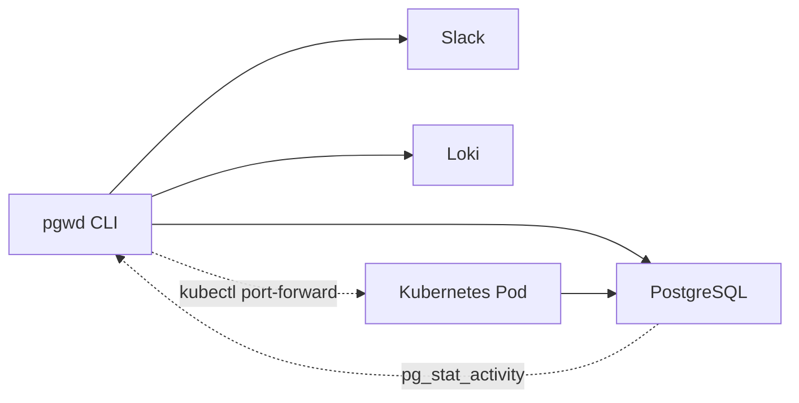

## What is pgwd?

pgwd (Postgres Watch Dog) is a Go CLI tool that monitors PostgreSQL connection usage and sends alerts via Slack and/or Loki when thresholds are exceeded. It helps you detect connection exhaustion, leaks, and saturation before they impact your application.

## Key features

<CardGroup cols={2}>
  <Card title="Flexible thresholds" icon="gauge-high">
    Monitor total, active, idle, and stale connections with customizable thresholds or 3-tier percentage-based alerts (75/85/95% by default)
  </Card>
  
  <Card title="Multiple notifiers" icon="bell">
    Send alerts to Slack and/or Loki simultaneously with rich context including connection counts and severity levels
  </Card>
  
  <Card title="Kubernetes native" icon="kubernetes">
    Connect to Postgres in Kubernetes via kubectl port-forward with automatic password discovery from pod environment
  </Card>
  
  <Card title="Run anywhere" icon="server">
    Works as a one-shot command (ideal for cron), long-running daemon, or Docker container. Supports Linux, macOS, and Windows
  </Card>
</CardGroup>

## Use cases

### Cron monitoring
Run pgwd every 5 minutes from cron to catch connection spikes before they become incidents. Perfect for periodic health checks without keeping a daemon running.

### Daemon mode
Run pgwd continuously with configurable check intervals. Ideal for systemd services or Docker deployments where you want constant monitoring.

### Connection leak detection
Use stale connection monitoring to detect connections that stay open too long and never close — a common sign of connection leaks in application code.

### Multi-environment alerting
Deploy pgwd across dev, staging, and production environments with environment-specific configuration via environment variables and Loki labels.

## How it works

pgwd connects to your PostgreSQL database and queries `pg_stat_activity` to count connections in different states:

- **Total**: All connections to the database
- **Active**: Connections currently executing queries
- **Idle**: Connections open but not running queries
- **Stale**: Connections open longer than a configured age threshold

When connection counts exceed your thresholds, pgwd sends formatted alerts to your configured notifiers with full context about the breach.

<Note>
  pgwd always sends a connection failure alert to configured notifiers when it cannot connect to Postgres — no extra flag required. This ensures you're notified about infrastructure issues.
</Note>

## Architecture overview

pgwd is designed as a lightweight, single-binary tool with minimal dependencies:

- **Configuration**: CLI flags and environment variables (prefix `PGWD_`)
- **Database**: Direct connection via PostgreSQL URL or Kubernetes port-forward
- **Thresholds**: Explicit counts or percentage-based 3-tier levels
- **Alerting**: HTTP webhooks to Slack and/or Loki push API
- **Modes**: One-shot (interval=0) or daemon (interval>0)

## Next steps

<CardGroup cols={2}>
  <Card title="Installation" icon="download" href="/installation">
    Install pgwd from source, Homebrew, or pre-built binaries
  </Card>
  
  <Card title="Quick start" icon="rocket" href="/quickstart">
    Get your first check running in under 5 minutes
  </Card>
</CardGroup>
